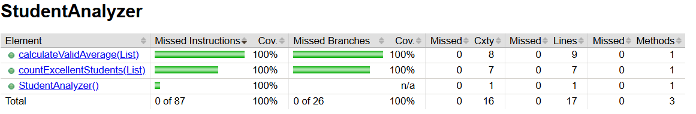

# Student Analyzer - Unit Testing with JUnit

## Mô tả bài tập

Viết chương trình Java để phân tích điểm số học sinh, gồm:

- Đếm số học sinh đạt loại Giỏi (điểm >= 8.0), bỏ qua các điểm số không hợp lệ (nhỏ hơn 0 hoặc lớn hơn 10).
- Tính điểm trung bình của các điểm hợp lệ (từ 0 đến 10).

## Cấu trúc dự án

```
student-analyzer
 ├── src
 │    ├── main
 │    │    └── java
 │    │         └── com/mycompany/student/analyzer/
 │    │              └── Main.java
 │    │              └── StudentAnalyzer.java
 │    └─── test
 │         └── java
 │              └── com/mycompany/student/analyzer/
 │                   └── StudentAnalyzerTest.java
 ├── README.md
 └── pom.xml
```

## Hướng dẫn chạy và kiểm thử

### Yêu cầu

- JDK 8 trở lên
- Maven 3.x
- IDE (NetBeans, IntelliJ IDEA, Eclipse...) hoặc dòng lệnh

### Cách chạy chương trình

1. Chuột phải vào thư mục gốc dự án, nhấn vào Open in Terminal.
2. Biên dịch:

   ```bash
   mvn compile
   ```

3. Chạy chương trình chính:

   ```bash
   mvn exec:java --% -Dexec.mainClass=com.mycompany.student.analyzer.Main
   ```

Hoặc chạy trực tiếp trong IDE bằng nút run.

### Cách chạy test

```bash
mvn test
```

## Đo Bao Phủ Kiểm Thử (Code Coverage)
Dự án sử dụng plugin **JaCoCo** để đo tỷ lệ bao phủ kiểm thử.
### Cách đo
Chạy lệnh sau trong thư mục dự án:

```bash
mvn clean verify
```
Sau khi chạy xong, mở file sau để xem báo cáo chi tiết:
```bash
target/site/jacoco/index.html
```

## Kết quả đo độ bao phủ kiểm thử (Code Coverage)
